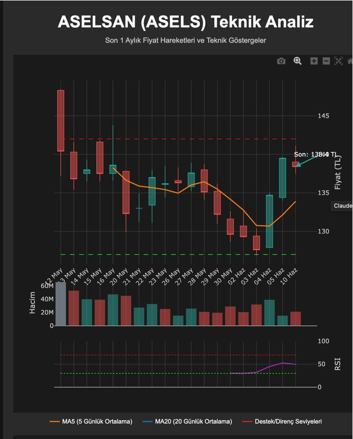
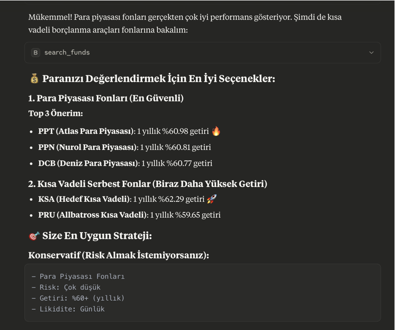

# Borsa MCP: Türk Finans Piyasaları için MCP Sunucusu

[](https://www.star-history.com/#saidsurucu/borsa-mcp&Date)

Borsa İstanbul (BIST) ve ABD (US) hisseleri, TEFAS fonları, kripto paralar ve döviz/emtia verilerine LLM'ler üzerinden erişim sağlayan [FastMCP](https://gofastmcp.com/) sunucusu. KAP, Yahoo Finance, BtcTurk, Coinbase, borsapy ve TCMB gibi kaynaklardan **26 birleşik araç** ile kapsamlı finansal analiz.





---

## ⚠️ Önemli Uyarılar

- **LLM'ler halüsinasyon yapabilir** - Verileri mutlaka doğrulayın
- **Yatırım tavsiyesi değildir** - Profesyonel danışmanlık alın
- **Eğitim amaçlıdır** - Sorumluluk size aittir

---

## 🚀 5 Dakikada Başla (Remote MCP)

**✅ Kurulum Gerektirmez! Hemen Kullan!**

🔗 **Remote MCP Adresi:** https://borsamcp.fastmcp.app/mcp

### Claude Desktop ile Kullanım (Ücretli abonelik gerekir)

1. **Claude Desktop**'ı açın
2. **Settings** → **Connectors** → **Add Custom Connector**
3. Bilgileri girin:
   - **Name:** `Borsa MCP`
   - **URL:** `https://borsamcp.fastmcp.app/mcp`
4. **Add** butonuna tıklayın
5. Hemen kullanmaya başlayın! 🎉

### Google Antigravity ile Kullanım

1. Agent session açın ve editörün yan panelindeki "…" dropdown menüsüne tıklayın
2. **MCP Servers** seçeneğini seçin - MCP Store açılacak
3. Üstteki **Manage MCP Servers** butonuna tıklayın
4. **View raw config** seçeneğine tıklayın
5. `mcp_config.json` dosyasına aşağıdaki yapılandırmayı ekleyin:

```json
{
  "mcpServers": {
    "borsa-mcp": {
      "serverUrl": "https://borsamcp.fastmcp.app/mcp",
      "headers": {
        "Content-Type": "application/json"
      }
    }
  }
}
```

💡 **İpucu:** Remote MCP sayesinde Python, uv veya herhangi bir kurulum yapmadan doğrudan Google Antigravity üzerinden Türk finans piyasalarına erişebilirsiniz!

**Örnek Sorular:**
```
GARAN hissesinin son 1 aylık performansını analiz et
XU100 endeksinin bugünkü durumunu göster
Bitcoin'in TRY fiyatını kontrol et
```

---

## 🎯 Temel Özellikler

**26 Birleşik Araç ile Kapsamlı Finansal Analiz (v0.9.0):**

* 📈 **Hisse Senetleri (BIST + US):** 758 BIST + tüm NYSE/NASDAQ şirketleri, tek araçla `market` parametresi ile
* 🔍 **Teknik Tarama:** BIST teknik scanner (RSI, MACD, Supertrend, T3) + US screener (23 preset)
* 🆕 **Makro Veriler:** TCMB enflasyon verileri ve hesaplama araçları (`get_macro_data`)
* 🎯 **Pivot Points:** 3 direnç & 3 destek seviyesi hesaplama (klasik pivot formülü)
* 📊 **Endeksler:** BIST + US endeksleri tek araçla (`get_index_data`)
* 💡 **Değer Yatırımı:** Buffett analizi ve finansal sağlık araçları (ROE, ROIC, Altman Z-Score)
* 💰 **TEFAS Fonları:** 836+ fon, performans, portföy, karşılaştırma (`compare_mode`)
* ₿ **Kripto Paralar:** BtcTurk + Coinbase birleşik (`get_crypto_market`)
* 💱 **Döviz & Emtia:** 65 para birimi, altın, petrol (borsapy entegrasyonu)
* 📅 **Ekonomik Takvim:** TR, US, EU, DE, GB, JP, CN (7 ülke)
* ☪️ **Katılım Finans:** Katılım finans uygunluk bilgisi (`include_islamic` parametresi)
* 📰 **KAP Haberleri:** Liste + detay (`news_id` parametresi ile)
* 📋 **Yardım Araçları:** `get_screener_help`, `get_scanner_help`, `get_regulations`
* ⚡ **LLM Optimizasyonu:** İngilizce açıklamalar, domain-spesifik araç seçimi
* 🚀 **FastMCP 2.14:** Response Caching + Background Tasks

## 📑 İçindekiler

| Bölüm | Açıklama |
|-------|----------|
| [🚀 5 Dakikada Başla](#-5-dakikada-başla-remote-mcp) | Kurulum gerektirmez - Remote MCP |
| [🎯 Temel Özellikler](#-temel-özellikler) | 26 birleşik araç ile kapsamlı finansal analiz |
| [💻 Gelişmiş Kurulum](#-gelişmiş-kurulum-isteğe-bağlı) | 5ire, Claude Desktop local kurulum |
| [🛠️ Kullanılabilir Araçlar](#️-kullanılabilir-araçlar-mcp-tools) | BIST, US, Kripto, Döviz, Fon araçları |
| [🔍 Veri Kaynakları](#-veri-kaynakları--kapsam) | KAP, Yahoo Finance, BtcTurk, Coinbase, TCMB |
| [📊 Örnek Kullanım](#-örnek-kullanım) | Pratik sorgular ve analiz örnekleri |

---

## 💻 Gelişmiş Kurulum (İsteğe Bağlı)

**Not:** Remote MCP kullanıyorsanız bu adımları atlayabilirsiniz!

### 5ire ve Diğer MCP İstemcileri için Local Kurulum

Bu bölüm, Borsa MCP'yi 5ire gibi diğer MCP istemcileriyle local olarak kullanmak isteyenler içindir.

* **Python Kurulumu:** Sisteminizde Python 3.11 veya üzeri kurulu olmalıdır. Kurulum sırasında "**Add Python to PATH**" (Python'ı PATH'e ekle) seçeneğini işaretlemeyi unutmayın. [Buradan](https://www.python.org/downloads/) indirebilirsiniz.
* **Git Kurulumu (Windows):** Bilgisayarınıza [git](https://git-scm.com/downloads/win) yazılımını indirip kurun. "Git for Windows/x64 Setup" seçeneğini indirmelisiniz.
* **`uv` Kurulumu:**
    * **Windows Kullanıcıları (PowerShell):** Bir CMD ekranı açın ve bu kodu çalıştırın: `powershell -ExecutionPolicy ByPass -c "irm https://astral.sh/uv/install.ps1 | iex"`
    * **Mac/Linux Kullanıcıları (Terminal):** Bir Terminal ekranı açın ve bu kodu çalıştırın: `curl -LsSf https://astral.sh/uv/install.sh | sh`
* **Microsoft Visual C++ Redistributable (Windows):** Bazı Python paketlerinin doğru çalışması için gereklidir. [Buradan](https://learn.microsoft.com/en-us/cpp/windows/latest-supported-vc-redist?view=msvc-170) indirip kurun.
* İşletim sisteminize uygun [5ire](https://5ire.app) MCP istemcisini indirip kurun.
* 5ire'ı açın. **Workspace -> Providers** menüsünden kullanmak istediğiniz LLM servisinin API anahtarını girin.
* **Tools** menüsüne girin. **+Local** veya **New** yazan butona basın.
    * **Tool Key:** `borsamcp`
    * **Name:** `Borsa MCP`
    * **Command:**
        ```
        uvx --from git+https://github.com/saidsurucu/borsa-mcp borsa-mcp
        ```
    * **Save** butonuna basarak kaydedin.
* Şimdi **Tools** altında **Borsa MCP**'yi görüyor olmalısınız. Üstüne geldiğinizde sağda çıkan butona tıklayıp etkinleştirin (yeşil ışık yanmalı).
* Artık Borsa MCP ile konuşabilirsiniz.

### Claude Desktop için Local Kurulum

**Not:** Remote MCP daha kolay bir seçenektir. Sadece local kurulum yapmak istiyorsanız bu adımları izleyin.

1.  **Ön Gereksinimler:** Python, `uv`, (Windows için) Microsoft Visual C++ Redistributable'ın sisteminizde kurulu olduğundan emin olun. Detaylı bilgi için yukarıdaki "5ire için Kurulum" bölümündeki ilgili adımlara bakabilirsiniz.
2.  Claude Desktop **Settings -> Developer -> Edit Config**.
3.  Açılan `claude_desktop_config.json` dosyasına `mcpServers` altına ekleyin. UYARI: // ile başlayan yorum satırını silmelisiniz:

    ```json
    {
      "mcpServers": {
        // ... (varsa diğer sunucularınız) ...
        "Borsa MCP": {
          "command": "uvx",
          "args": [
            "--from", "git+https://github.com/saidsurucu/borsa-mcp",
            "borsa-mcp"
          ]
        }
      }
    }
    ```
4.  Claude Desktop'ı kapatıp yeniden başlatın.

---

## 🛠️ Kullanılabilir Araçlar (MCP Tools)

Bu FastMCP sunucusu LLM modelleri için **26 birleşik araç** sunar. Tüm araçlar `market` parametresi ile BIST ve US piyasalarını destekler.

### Hisse Senedi Araçları (15 araç - BIST + US)
| Araç | Açıklama | Multi-ticker |
|------|----------|--------------|
| `search_symbol` | Hisse, endeks, fon, kripto sembol arama | - |
| `get_profile` | Şirket profili (sektör, açıklama, finansallar) + `include_islamic` | - |
| `get_quick_info` | Hızlı metrikler (P/E, P/B, ROE, 52h aralık) | ✅ |
| `get_historical_data` | OHLCV fiyat verileri (tarih aralığı desteği) | - |
| `get_technical_analysis` | RSI, MACD, Bollinger Bantları, hareketli ortalamalar | - |
| `get_pivot_points` | Destek/direnç seviyeleri (S1-S3, R1-R3) | - |
| `get_analyst_data` | Analist derecelendirmeleri ve fiyat hedefleri | ✅ |
| `get_dividends` | Temettü geçmişi, verim, dağıtım oranı | ✅ |
| `get_earnings` | Kazanç takvimi, EPS geçmişi, büyüme tahminleri | ✅ |
| `get_financial_statements` | Bilanço, gelir tablosu, nakit akışı | ✅ |
| `get_financial_ratios` | Değerleme, Buffett, sağlık, gelişmiş metrikler | - |
| `get_corporate_actions` | Sermaye artırımları, temettü geçmişi (BIST) | ✅ |
| `get_news` | KAP haberleri + `news_id` ile detay | - |
| `screen_securities` | 23 preset veya özel filtreler ile tarama | - |
| `scan_stocks` | Teknik scanner (RSI, MACD, Supertrend, T3) | - |

### Kripto Araçları (1 araç - BtcTurk + Coinbase)
| Araç | Açıklama |
|------|----------|
| `get_crypto_market` | Ticker, orderbook, trades, OHLC, borsa bilgileri |

### FX & Makro Araçları (4 araç)
| Araç | Açıklama |
|------|----------|
| `get_fx_data` | 65 para birimi, metaller, emtialar (borsapy) |
| `get_economic_calendar` | Ekonomik olaylar (TR, US, EU, DE, GB, JP, CN) |
| `get_bond_yields` | Devlet tahvil faizleri (TR 2Y, 5Y, 10Y) |
| `get_sector_comparison` | Sektör karşılaştırması ve ortalama metrikler |

### Fon & Endeks Araçları (2 araç)
| Araç | Açıklama |
|------|----------|
| `get_fund_data` | TEFAS fon verileri + `compare_mode` ile karşılaştırma |
| `get_index_data` | Borsa endeks verileri (BIST + US) |

### Makro & Yardım Araçları (4 araç)
| Araç | Açıklama |
|------|----------|
| `get_macro_data` | TCMB enflasyon verileri ve hesaplama |
| `get_screener_help` | Screener presetleri ve filtre dokümantasyonu |
| `get_scanner_help` | BIST scanner göstergeleri ve presetler |
| `get_regulations` | Türk yatırım fonu mevzuatı |

### Eski Sunucu (Geriye Uyumluluk)

Legacy sunucu (81 araç) `borsa-mcp-legacy` komutu ile hala kullanılabilir.

---

## 🔍 Veri Kaynakları & Kapsam

### KAP (Kamuyu Aydınlatma Platformu)
- **Şirketler**: 758 BIST şirketi (ticker kodları, adlar, şehirler, çoklu ticker desteği)
- **Katılım Finans**: Resmi katılım finans uygunluk değerlendirmeleri
- **Güncelleme**: Otomatik önbellek ve yenileme

### Yahoo Finance Entegrasyonu
- **Endeks Desteği**: Tüm BIST endeksleri (XU100, XBANK, XK100 vb.) için tam destek
- **Zaman Dilimi**: Tüm zaman damgaları Avrupa/İstanbul'a çevrilir
- **Veri Kalitesi**: Büyük bankalar ve teknoloji şirketleri en iyi kapsama sahiptir
- **Tarih Aralığı Desteği**: Belirli tarihler arası sorgulama (YYYY-MM-DD formatında, örn: "2024-01-01" - "2024-12-31")
- **İki Sorgu Modu**:
  - **Dönem Modu:** Period parametresi ile (1d, 1mo, 1y, vb.) - varsayılan
  - **Tarih Modu:** start_date ve end_date parametreleri ile belirli tarih aralığı

### US Stock Market (Yahoo Finance)
- **Kapsam**: S&P 500, Nasdaq-100, Dow Jones ve NYSE'deki tüm şirketler
- **Endeksler**: 28 ana US endeksi (^GSPC, ^IXIC, ^DJI, Russell, sektör ETF'leri)
- **Kategoriler**: Large Cap, Tech, Blue Chip, Small Cap, Mid Cap, International
- **Finansal Tablolar**: Quarterly ve annual balance sheet, income statement, cash flow
- **Değer Analizi**: Buffett analizi için US 10Y Treasury (^TNX) ve Fed %2.5 enflasyon hedefi
- **Güncelleme**: Gerçek zamanlı piyasa verileri

### US Stock Screener (yfscreen paketi)
- **Varlık Türleri**: Hisse senedi (equity), ETF ve yatırım fonları (mutual funds)
- **Preset Sayısı**: 23 hazır tarama şablonu (18 hisse + 3 ETF + 2 yatırım fonu)
- **Filtre Alanları**: 96+ hisse senedi, 29 ETF, 28 yatırım fonu filtre alanı
- **Operatörler**: eq (eşit), gt (büyük), lt (küçük), btwn (arasında)
- **Özel Filtreler**: Kullanıcı tanımlı filtreler ile gelişmiş tarama
- **Akıllı Alan Dönüşümü**: ETF/fund taramalarında equity alanları otomatik dönüştürülür
- **Otomatik Region**: Custom filter kullanırken `region=us` otomatik eklenir
- **Sayfalama**: Offset/limit ile büyük sonuç setlerinde navigasyon
- **Performans**: Yahoo Finance screener API entegrasyonu, hızlı sonuçlar

### BIST Hisse Tarayıcı (borsapy paketi)
- **Veri Kaynağı**: İş Yatırım gelişmiş hisse arama (borsapy kütüphanesi)
- **Preset Sayısı**: 15 hazır tarama şablonu (piyasa değeri, değer, temettü, momentum, hacim, yabancı, analist)
- **Filtre Kriteri**: 50+ filtre (13 kategori: değerleme, kârlılık, temettü, getiri, piyasa, yabancı, analist, endeks)
- **Operatörler**: min (minimum), max (maximum) ile aralık filtreleme
- **Özel Filtreler**: Kullanıcı tanımlı filtreler ile gelişmiş tarama
- **Otomatik Birim Dönüşümü**: Piyasa değeri ve hacim için TL → milyon TL otomatik dönüşüm
- **Sayfalama**: Offset/limit ile büyük sonuç setlerinde navigasyon
- **Performans**: İş Yatırım API entegrasyonu, hızlı sonuçlar
- **Güncelleme**: Gerçek zamanlı BIST verileri

### Mynet Finans (Hibrit Mod)
- **Türk Özel Verileri**: Kurumsal yönetim, ortaklık yapısı, bağlı şirketler
- **KAP Haberleri**: Gerçek zamanlı resmi duyuru akışı
- **Endeks Kompozisyonu**: Canlı endeks şirket listeleri

### TEFAS (Türkiye Elektronik Fon Alım Satım Platformu)
- **Fon Evreni**: 800+ Türk yatırım fonu
- **Resmi API**: TEFAS BindHistoryInfo ve BindHistoryAllocation API'leri
- **Kategori Filtreleme**: 13 fon kategorisi (borçlanma, hisse senedi, altın vb.)
- **Performans Metrikleri**: 7 dönemlik getiri analizi (1 günlük - 3 yıllık)
- **Portföy Analizi**: 50+ Türk varlık kategorisi ile detaylı dağılım
- **Güncellik**: Gerçek zamanlı fon fiyatları ve performans verileri

### Fon Mevzuatı
- **Kaynak**: `fon_mevzuat_kisa.md` - 80,820 karakter düzenleme metni
- **Kapsam**: Yatırım fonları için kapsamlı Türk mevzuatı
- **İçerik**: Portföy limitleri, fon türleri, uyumluluk kuralları
- **Güncelleme**: Dosya metadata ile son güncelleme tarihi

### BtcTurk Kripto Para Borsası (Türk Piyasası)
- **İşlem Çiftleri**: 295+ kripto para işlem çifti (ana TRY ve USDT piyasaları dahil)
- **Para Birimleri**: 158+ desteklenen kripto para ve fiat para birimi (BTC, ETH, TRY, USDT vb.)
- **API Endpoint**: Resmi BtcTurk Public API v2 (https://api.btcturk.com/api/v2)
- **Piyasa Verileri**: Gerçek zamanlı ticker fiyatları, emir defterleri, işlem geçmişi, OHLC/Kline grafikleri
- **Türk Odak**: TRY çiftleri için optimize edilmiş (BTCTRY, ETHTRY, ADATRY vb.)
- **Güncelleme Sıklığı**: Borsa bilgileri için 1 dakika önbellek ile gerçek zamanlı piyasa verileri
- **Veri Kalitesi**: Milisaniye hassasiyetli zaman damgaları ile profesyonel seviye borsa verileri

### Coinbase Global Kripto Para Borsası (Uluslararası Piyasalar)
- **İşlem Çiftleri**: 500+ global kripto para işlem çifti (ana USD, EUR ve GBP piyasaları dahil)
- **Para Birimleri**: 200+ desteklenen kripto para ve fiat para birimi (BTC, ETH, USD, EUR, GBP vb.)
- **API Endpoint**: Resmi Coinbase Advanced Trade API v3 ve App API v2 (https://api.coinbase.com)
- **Piyasa Verileri**: Gerçek zamanlı ticker fiyatları, emir defterleri, işlem geçmişi, OHLC/mum grafikleri, sunucu zamanı
- **Global Odak**: Uluslararası piyasalar için USD/EUR çiftleri (BTC-USD, ETH-EUR vb.)
- **Güncelleme Sıklığı**: Borsa bilgileri için 5 dakika önbellek ile gerçek zamanlı piyasa verileri
- **Veri Kalitesi**: Coinbase (NASDAQ: COIN) kurumsal seviye global likidite ile işletme düzeyinde borsa verileri
- **Kapsam**: Tam global piyasa kapsama, kurumsal seviye işlem verileri, çapraz piyasa arbitraj fırsatları
- **Çapraz Piyasa Analizi**: Türk kripto piyasaları (BtcTurk TRY çiftleri) ile global piyasaları (Coinbase USD/EUR çiftleri) karşılaştırma

### Dovizcom Döviz & Emtia Platformu (Türk & Uluslararası Piyasalar)
- **Varlık Kapsamı**: 28+ varlık (ana para birimleri, kıymetli madenler, enerji emtiaları, yakıt fiyatları)
- **Ana Para Birimleri**: USD, EUR, GBP, JPY, CHF, CAD, AUD ile gerçek zamanlı TRY döviz kurları
- **Kıymetli Madenler**: Hem Türk (gram-altın, gümüş) hem uluslararası (ons, XAG-USD, XPT-USD, XPD-USD) çifte fiyatlandırma
- **Enerji Emtiaları**: BRENT ve WTI petrol fiyatları ile tarihsel trendler ve piyasa analizi
- **Yakıt Fiyatları**: Dizel, benzin ve LPG fiyatları (TRY bazlı) ile günlük fiyat takibi
- **API Endpoint**: Resmi doviz.com API v12 (https://api.doviz.com/api/v12)
- **Gerçek Zamanlı Veri**: Kısa vadeli analiz için 60 veri noktasına kadar dakikalık güncellemeler
- **Tarihsel Veri**: Teknik analiz ve trend araştırması için özel tarih aralıklarında günlük OHLC verileri
- **Güncelleme Sıklığı**: Güncel kurlar için 1 dakika önbellek ile gerçek zamanlı piyasa verileri
- **Veri Kalitesi**: Türkiye'nin önde gelen finansal bilgi sağlayıcısından profesyonel seviye finansal veriler
- **Piyasa Odağı**: Çapraz piyasa analizi için uluslararası USD/EUR karşılaştırmaları ile Türk TRY bazlı fiyatlandırma
- **Kimlik Doğrulama**: Güvenilir API erişimi için uygun başlık yönetimi ile Bearer token kimlik doğrulaması
- **Kapsam**: Döviz ticareti, kıymetli maden yatırımı, emtia analizi ve yakıt fiyat takibi için tam finansal piyasalar kapsamı

### Dovizcom Ekonomik Takvim (Çoklu Ülke Desteği)
- **Makroekonomik Olaylar**: GDP, enflasyon, istihdam, sanayi üretimi, PMI, işsizlik oranları ve diğer piyasa etkili ekonomik göstergeler
- **Ülke Kapsamı**: 30+ ülke (TR, US, EU, GB, JP, DE, FR, CA, AU, CN, KR, BR vb.) için ekonomik veri takibi
- **Çoklu Ülke Filtreleme**: Virgülle ayrılmış ülke kodları ile esnek filtreleme (örn: "TR,US,DE")
- **Varsayılan Davranış**: Türkiye ve ABD ekonomik olayları (TR,US) varsayılan olarak gösterilir
- **API Endpoint**: Resmi Doviz.com Economic Calendar API (https://www.doviz.com/calendar/getCalendarEvents)
- **Filtreleme Özellikleri**: Ülke bazlı filtreleme, önem seviyesi seçimi (yüksek/orta/düşük), özelleştirilebilir tarih aralıkları
- **Veri Detayları**: Gerçek değerler, önceki dönem verileri, tahminler (mevcut olduğunda), dönem bilgileri Türkçe açıklamalar
- **Güncelleme Sıklığı**: Gerçek zamanlı ekonomik olay takibi ve uluslararası piyasa etkisi analizi
- **Zaman Dilimi Desteği**: Avrupa/İstanbul ana zaman dilimi ile Türk saati koordinasyonu
- **Veri Kalitesi**: Doviz.com'un özelleşmiş finansal veri ağından profesyonel seviye uluslararası makroekonomik bilgiler

### TCMB Enflasyon Verileri (Resmi Merkez Bankası)
- **Veri Kaynağı**: Türkiye Cumhuriyet Merkez Bankası resmi enflasyon istatistikleri sayfaları
- **Veri Türleri**: 
  - **TÜFE:** Tüketici Fiyat Endeksi (2005-2025, 245+ aylık kayıt)
  - **ÜFE:** Üretici Fiyat Endeksi - Yurt İçi (2014-2025, 137+ aylık kayıt)
- **Güncelleme Sıklığı**: Aylık (genellikle ayın ortasında resmi açıklama)
- **Veri Kalitesi**: Resmi TCMB kaynağından web scraping ile %100 güvenilir
- **Performans**: 2-3 saniye (1 saatlik cache ile optimize edilmiş)
- **Filtreleme**: Enflasyon türü seçimi, tarih aralığı (YYYY-MM-DD), kayıt sayısı limiti
- **İstatistikler**: Min/max oranlar, ortalamalar, son değerler otomatik hesaplama
- **Son Veriler (Mayıs 2025)**: 
  - **TÜFE:** %35.41 (yıllık), %1.53 (aylık)
  - **ÜFE:** %23.13 (yıllık), %2.48 (aylık)
- **Ekonomik Analiz**: ÜFE öncü gösterge olarak TÜFE hareketlerini öngörmede kullanılır

---

## 📊 Örnek Kullanım

```
# Şirket arama
GARAN hissesi için detaylı analiz yap

# Endeks analizi
XU100 endeksinin son 1 aylık performansını analiz et

# Tarih aralığı ile hisse analizi (YENİ!)
GARAN hissesinin 2024 yıl başından bugüne performansını analiz et

# Belirli dönem karşılaştırması (YENİ!)
THYAO'nun 2023 ve 2024 yıllarının ilk çeyreklerini karşılaştır

# Teknik analiz
ASELS için kapsamlı teknik analiz ve al-sat sinyalleri ver

# KAP haberleri
THYAO için son 5 KAP haberini getir ve ilkinin detayını analiz et

# Katılım finans
ARCLK'nın katılım finans uygunluğunu kontrol et

# Sektör karşılaştırması
Bankacılık sektöründeki ana oyuncuları karşılaştır: GARAN, AKBNK, YKBNK

# US hisse analizi
Apple (AAPL) hissesinin son 3 aylık performansını analiz et

# US finansal tablolar
Microsoft'un son yıllık bilançosunu getir

# US Buffett değer analizi
Amazon için Buffett değer analizi yap

# US endeks arama
Teknoloji sektörü endekslerini ara

# US sektör karşılaştırması
AAPL, MSFT, GOOGL şirketlerini sektör bazında karşılaştır

# US finansal sağlık analizi
Tesla için kapsamlı finansal sağlık analizi yap

# US hisse tarama (screener)
Büyük piyasa değerli (large cap) ABD hisselerini listele

# US değer hisseleri tarama
Düşük F/K oranına sahip (P/E < 15) değer hisselerini bul

# US yüksek temettü hisseleri
%5'ten fazla temettü veren ABD hisselerini ara

# US sektör bazlı tarama
Teknoloji sektöründeki büyük cap hisseleri listele

# US ETF tarama
10 milyar dolardan fazla AUM'a sahip büyük ETF'leri göster

# US özel filtre taraması
Piyasa değeri 100 milyar dolar üstü ve ROE > %20 olan hisseleri bul

# BIST hisse tarama (screener) - YENİ!
Yüksek temettü veren BIST hisselerini listele

# BIST düşük F/K tarama
F/K oranı 10'dan düşük BIST hisselerini bul

# BIST yüksek ROE tarama
ROE oranı %15'ten yüksek şirketleri ara

# BIST yabancı favorileri
Yabancı yatırımcı oranı %40'tan fazla olan hisseleri göster

# BIST momentum tarama
Yükseliş potansiyeli %20'den fazla olan hisseleri listele

# BIST özel filtre taraması
Piyasa değeri 10 milyar TL üstü ve temettü verimi %3'ten fazla olan hisseleri bul

# BIST analist tavsiyeleri
AL önerisi alan BIST hisselerini listele

# Fon arama ve analizi
"altın" fonları ara ve en iyi performans gösteren 3 tanesini karşılaştır

# Fon portföy analizi
AAK fonunun son 6 aylık portföy dağılım değişimini analiz et

# Fon mevzuat sorguları
Yatırım fonlarında türev araç kullanım limitleri nelerdir?

# Türk kripto para analizi
Bitcoin'in TRY cinsinden son 1 aylık fiyat hareketlerini analiz et

# Türk kripto piyasa takibi
BtcTurk'te en çok işlem gören kripto çiftleri listele ve fiyat değişimlerini göster

# Türk kripto emir defteri analizi
BTCTRY çiftinin emir defterini görüntüle ve derinlik analizini yap

# Global kripto para analizi
Bitcoin'in USD cinsinden Coinbase'deki son 1 aylık fiyat hareketlerini analiz et

# Global kripto piyasa takibi
Coinbase'de en popüler USD/EUR kripto çiftlerini listele ve global piyasa trendlerini göster

# Global kripto emir defteri analizi
BTC-USD çiftinin Coinbase emir defterini görüntüle ve global likidite analizini yap

# Çapraz piyasa kripto analizi
Bitcoin fiyatını Türk (BTCTRY) ve global (BTC-USD) piyasalarda karşılaştır

# Arbitraj fırsatı analizi
ETH fiyatlarını BtcTurk (ETHUSDT) ve Coinbase (ETH-USD) arasında karşılaştırarak arbitraj fırsatlarını tespit et

# BtcTurk kripto teknik analiz
BTCTRY çiftinin günlük teknik analizini yap ve al-sat sinyallerini değerlendir

# Coinbase global kripto teknik analiz  
BTC-USD çiftinin 4 saatlik teknik analizini yap ve RSI, MACD durumunu analiz et

# Çapraz piyasa teknik analiz karşılaştırması
Bitcoin'in hem Türk piyasasında (BTCTRY) hem global piyasada (BTC-USD) teknik analiz sinyallerini karşılaştır

# Global kripto teknik analiz
ETH-EUR çiftinin günlük Bollinger Bantları ve hareketli ortalama durumunu analiz et

# Döviz kuru analizi
USD/TRY kurunun güncel durumunu ve son 1 saatteki dakikalık hareketlerini analiz et

# Altın fiyat takibi
Gram altının TRY cinsinden güncel fiyatını al ve son 30 dakikadaki değişimini göster

# Uluslararası altın karşılaştırması
Türk gram altını ile uluslararası ons altın fiyatlarını karşılaştır

# Emtia fiyat analizi
Brent petrolün son 6 aylık OHLC verilerini al ve fiyat trendini analiz et

# Kıymetli maden portföy takibi
Altın, gümüş ve platinyum fiyatlarının güncel durumunu ve haftalık performansını karşılaştır

# Çapraz döviz analizi
EUR/TRY ve GBP/TRY kurlarının güncel durumunu karşılaştır ve arbitraj fırsatlarını değerlendir

# Yakıt fiyat takibi
Dizel, benzin ve LPG fiyatlarının güncel durumunu ve haftalık değişimlerini analiz et

# Yakıt fiyat karşılaştırması
Son 3 aylık dizel ve benzin fiyat trendlerini karşılaştır ve analiz et

# Haftalık ekonomik takvim (çoklu ülke)
Bu haftanın önemli ekonomik olaylarını TR,US,DE için listele ve piyasa etkilerini değerlendir

# Tek ülke ekonomik takip
Sadece Almanya'nın bu ayki ekonomik verilerini getir ve analiz et

# Çoklu ülke ekonomik karşılaştırma
TR,US,GB,FR,DE ülkelerinin bu haftaki tüm ekonomik verilerini karşılaştır

# Ekonomik veri analizi
Türkiye ve ABD'nin son çeyrek GDP büyüme verilerini karşılaştır ve trend analizini yap

# TCMB TÜFE enflasyon analizi
Son 2 yılın tüketici enflasyon verilerini getir ve trend analizini yap

# TCMB ÜFE enflasyon analizi  
Üretici enflasyonunun son 1 yılını analiz et ve TÜFE ile karşılaştır

# Enflasyon dönemsel analizi
2022-2024 yüksek enflasyon dönemini hem TÜFE hem ÜFE açısından analiz et

# TÜFE vs ÜFE karşılaştırması
Son 12 aylık TÜFE ve ÜFE verilerini karşılaştır ve fiyat geçişkenliğini analiz et

# Güncel enflasyon durumu
Son 6 aylık hem tüketici hem üretici enflasyon verilerini al ve Merkez Bankası hedefleriyle karşılaştır

# TCMB enflasyon hesaplayıcı analizi
2020'deki 100 TL'nin bugünkü satın alma gücünü hesapla

# Yüksek enflasyon dönemi analizi
2021-2024 yüksek enflasyon döneminde 1000 TL'nin değişimini hesapla ve kümülatif enflasyon etkisini analiz et

# Uzun dönemli satın alma gücü analizi
2010'dan bugüne 5000 TL'lik maaşın satın alma gücündeki değişimi hesapla

# Kısa dönemli enflasyon hesaplaması
Son 6 aylık enflasyon etkisini hesapla ve yıllık bazda projeksiyon yap

# Ekonomik kriz dönemleri karşılaştırması
2001, 2008 ve 2018 ekonomik krizlerinin enflasyon etkilerini karşılaştır

# Kontrat endeksleme hesaplaması
Kira sözleşmelerinin enflasyon ayarlaması için gerekli artış oranını hesapla
```

---

📜 **Lisans**

Bu proje MIT Lisansı altında lisanslanmıştır. Detaylar için `LICENSE` dosyasına bakınız.
